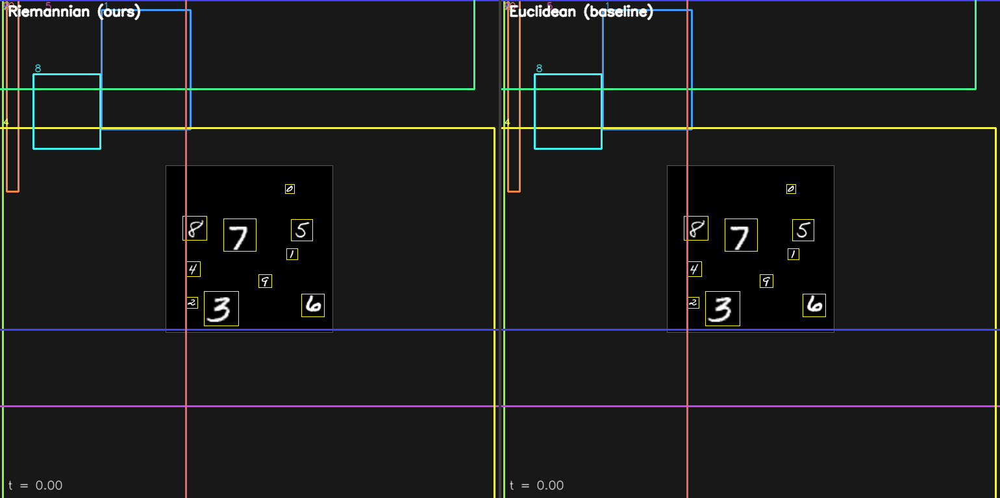

# Riemannian Flow for Object Detection

객체 검출에서 기하학적 연속 박스 궤적 모델링을 위한 연구 코드베이스.

## 개요

기존 검출 방식은 박스를 단일 스텝 회귀로 예측한다. 이 프로젝트는 박스 정제를 기하학적 box state space 위에서의 **연속 흐름(continuous flow)** 으로 모델링하며, flow matching으로 벡터 필드를 정의하고 학습한다.

핵심 기여:
- 기하학적 보간을 갖춘 box state space 정의 (`ℝ² × ℝ₊²`)
- box 궤적 학습을 위한 flow matching objective
- 벡터 필드 예측을 위한 DiT-style transformer
- 반복적 추론 정제(iterative inference refinement)

---

## Riemannian vs Euclidean — Toy 시각 비교

1장의 합성 MNIST Box 이미지(0~9 전체 10 digit, scale 14~56px, 256×256 canvas)에 두 trajectory를 **동일 조건**(5000 step, cosine LR, 50-step Euler ODE)으로 overfit한 결과 궤적:



> 좌: **Riemannian** (log-scale state space geodesic, ours) · 우: **Euclidean** (cxcywh 선형 보간, baseline)
> 같은 init noise `b₀`에서 시작 → t=1까지 10개 query가 GT digit에 수렴.
> Riemannian은 모든 box가 GT에 타이트하게 덮이지만, Euclidean은 size/position이 어긋남.

| Trajectory | tail₁₀₀ loss | mean err (px) | max err (px) |
|---|---|---|---|
| **Riemannian** (ours) | **0.026** | **4.0** | **10.0** |
| Euclidean (baseline) | 0.41 | 41.5 | 196.8 |

본 실험의 세부 설계·모델 다이어그램·코드 트레이스는 [`experiments/e0_mb5_overfit/report.md`](experiments/e0_mb5_overfit/report.md) 참고.

## 데이터셋

COCO, VOC

## 하드웨어

GPU 1장 · 96GB VRAM

## 구조

```
dataset/    # COCO/VOC 래퍼, box 연산, transforms
model/      # backbone, DiT blocks, flow matching, trajectory, loss
script/     # train, eval, infer, visualize, analyze
configs/    # 실험별 YAML 설정
utils/      # config, logger, seed, checkpoint, metrics
docs/       # 문제 정의, 계획, 논문 아웃라인
outputs/    # 체크포인트, 로그, 그림 (git 미추적)
```

## 빌드 및 환경 설정

### 사전 요구사항

- Docker + NVIDIA Container Toolkit
- NVIDIA GPU (96GB VRAM 권장)
- CUDA 호환 드라이버

### Docker로 실행 (권장)

```bash
# 처음 빌드 또는 Dockerfile 변경 시
docker compose up --build -d

# 이후 재실행
docker compose up -d

# 실행 중인 컨테이너 접속
docker compose exec rflow bash
```

빌드 과정:
1. CUDA 12.8.1 + cuDNN 베이스 이미지 (`nvidia/cuda:12.8.1-cudnn-devel-ubuntu22.04`)
2. Python 3.10, PyTorch (CUDA 12.8 빌드) 설치
3. `requirements.txt` 의존성 설치
4. Detectron2 소스 빌드 및 설치
5. 코드 마운트 (`./` → `/workspace/riemannian_flow_det`)

볼륨 마운트:
- 코드: `.` → 컨테이너 내 `/workspace/riemannian_flow_det` (수정 즉시 반영)
- 데이터: `./data` → `data/`
- 출력: `./outputs` → `outputs/`

포트:
- `6006`: TensorBoard (`tensorboard --logdir outputs/logs`)

### 로컬 설치 (Docker 미사용 시)

```bash
# PyTorch (CUDA 12.8)
pip install torch torchvision --index-url https://download.pytorch.org/whl/cu128

# 의존성
pip install -r requirements.txt
```

## 실행

### 학습

```bash
python script/train.py --config configs/coco.yaml
python script/train.py --config configs/coco.yaml --batch_size 4 --num_steps 5
```

### 평가

```bash
python script/eval.py --config configs/coco.yaml --checkpoint outputs/checkpoints/best.pth
```

### TensorBoard

```bash
tensorboard --logdir outputs/logs
```

### 모듈 단독 테스트

```bash
# 구현 완료
python dataset/box_ops.py
python dataset/voc.py --root data/voc --year 2007 --split val --download --vis_idx 0

# 미구현 (구현 후 주석 해제)
# python dataset/coco.py
# python dataset/transforms.py
# python model/flow_matching.py
```
