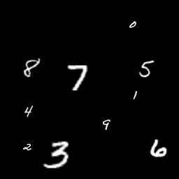
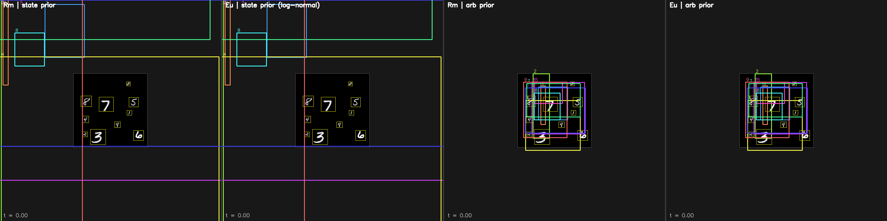

# e2 — 2×2 Ablation: Prior × Interp Space

> **e1 후속**. e1 은 prior 를 통일(`state N(0,I)`)해서 차이를 "interp 공간" 하나로
> 국한시켰다. 이 실험은 한 걸음 더 나아가 **prior × interp** 를 독립 축으로 분리
> 하는 2×2 실험. 특히 **arbitrary Euclidean prior**(`clip(N(0.5, 1/6²), 0.02, 1)`
> in cxcywh)를 새 prior 축으로 추가해 "prior 가 entropy 낮거나 support 이상
> 해도 interp 가 state 면 괜찮은가?" 를 정량화한다.
>
> **주요 발견 (스포일러)**: 원래 가설 "arb prior → 학습 실패" 은 **틀렸다**.
> 진짜 지배 요인은 **interp 공간** 하나이며, arb prior 는 오히려
> *state interp* 와 결합하면 baseline 보다 더 좋은 수렴을 낸다.

---

## 1. 목표

"유클리드 공간에서 임의 box prior 가 왜 나쁜가?" 를 2×2 로 분해:

|           | **state interp** (Rm)            | **cxcywh interp** (Eu)              |
|-----------|----------------------------------|-------------------------------------|
| state N(0,I) prior         | `riemannian` (e1 기준)        | `euclidean` (e1 baseline)           |
| arb cxcywh prior           | `riemannian_arb_prior` (NEW)  | `euclidean_arb_prior` (NEW)         |

- **행**을 비교 → **prior** 의 영향
- **열**을 비교 → **interp 공간** 의 영향
- 대각선 비교 → 상호작용

가설:
- (H1) prior entropy 가 중요하다면 arb prior 행의 두 cell 모두 나쁠 것
- (H2) interp 공간이 중요하다면 cxcywh interp 열의 두 cell 모두 나쁠 것
- (H3) 둘 다 중요하다면 `euclidean_arb_prior` 가 최악, `riemannian` 이 최고

---

## 2. 설계

네 trajectory 를 같은 모델·같은 GT 에 붙여 비교.

| variant | b₀ 공간 | b₀ 분포 | interp 공간 | 이론 u_t |
|---|---|---|---|---|
| `riemannian` | state | `N(0, I)` ∈ ℝ⁴ | state | `b₁−b₀` (const in x_t) |
| `euclidean` | state | `N(0, I)` → cxcywh (exp ⇒ log-normal) | cxcywh | `[Δcx, Δcy, Δw/w_t, Δh/h_t]` |
| `riemannian_arb_prior` | **cxcywh** | `clip(N(0.5, 1/6²), 0.02, 1)` | **state** | `b₁−b₀` (const, but bounded b₀) |
| `euclidean_arb_prior` | cxcywh | 동일 arb prior | cxcywh | 동일 time-dependent 형태 |

구현: [`model/trajectory.py`](../../model/trajectory.py) — `LinearTrajectoryArbPrior`, `RiemannianTrajectoryArbPrior`.

---

## 3. 공통 학습 설정

e1 동일. 변하는 것은 `trajectory` 필드 하나.

| 항목 | 값 |
|------|-----|
| dataset | `mnist_box` · 1 sample · 10 digit · 14~56 px · non-overlap |
| 모델 | FPN · hidden 192 · depth 4 · 6 head · 10 query |
| optim | AdamW · lr 3e-4 · cosine → 1.5e-5 · grad clip 1.0 |
| 학습 | 5000 step, batch 1 |
| 추론 | Euler ODE 50 step |
| seed | 0 |

실행: `bash experiments/e2_arbitrary_euclidean_prior/run.sh`

---

## 4. 결과

### 4.1 Target field 분석 (학습 전, 200 k 샘플)

**||u_t||₂** (state 공간)

| variant | mean | std | p99 | max |
|---|---|---|---|---|
| riemannian | 3.52 | 0.98 | 5.87 | 8.6 |
| euclidean  | 3.65 | **3.77** | **18.5** | **229.6** |
| riemannian_arb_prior | **1.98** | **0.50** | **3.10** | **3.9** |
| euclidean_arb_prior  | 1.99 | 1.16 | 6.53 | 15.0 |

**Conditional Lipschitz** `L̂(x_t) ≈ |u_t_{log_w}|`

| variant | p99 | max |
|---|---|---|
| riemannian | **0** | **0** |
| riemannian_arb_prior | **0** | **0** |
| euclidean | 16.80 | **229.5** |
| euclidean_arb_prior | 5.84 | 14.9 |

Key: **state interp 를 쓰면 prior 와 무관하게 Lipschitz 0** (constant field). cxcywh interp 일 때만 1/w 항이 생겨 L̂ 유한값. `riemannian_arb_prior` 는 `||u_t||` 자체가 가장 작고 std 도 가장 작음 — **target 자체가 가장 깨끗**한 regression 문제.

### 4.2 5000-step 학습 결과 — **single-seed (참고용, variance 주의)**

> ⚠️ 아래 표는 seed=0 단일 run 결과. 동일 config 를 다시 돌리면 값이 **크게 바뀐다**
> — 특히 `arb_prior` 계열. 신뢰 가능한 수치는 **§4.2a multi-seed** 표 참조.
> Variance 이슈는 [`docs/ISSUES.md`](../../docs/ISSUES.md) 에 별도 기록.

| variant | prior | interp | tail100 | mean err (px) | max err (px) | wall |
|---|---|---|---|---|---|---|
| riemannian | state | state | 0.029 | 5.6 | 17.2 | ~58 s |
| euclidean  | state | cxcywh | 0.957 | 30.5 | 93.5 | ~58 s |
| riemannian_arb_prior | arb | state | 0.007 | 2.6 | 19.0 | ~58 s |
| euclidean_arb_prior | arb | cxcywh | 0.321 | 35.8 | 100.3 | ~58 s |

### 4.2a 5000-step × 3 seed — **mean ± std** (rigorous)

독립 python process × 3 seed (0, 1, 2) 집계. Runner: [`run_multiseed.sh`](run_multiseed.sh).

| variant | n | tail100_loss mean±std | **mean_err_px** mean±std | **max_err_px** mean±std | final_loss mean±std |
| --- | --- | --- | --- | --- | --- |
| **riemannian** | 3 | **0.026 ± 0.004** | **6.56 ± 4.03** | **34.47 ± 30.04** | 0.039 ± 0.024 |
| euclidean | 3 | 1.13 ± 0.84 | 6.77 ± 2.70 | 50.40 ± 32.05 | 0.014 ± 0.005 |
| riemannian_arb_prior | 3 | 0.081 ± 0.076 | 23.27 ± 14.65 | 107.10 ± 78.23 | 0.071 ± 0.072 |
| euclidean_arb_prior | 3 | 0.257 ± 0.094 | 38.77 ± 6.24 | 149.71 ± 54.15 | 0.179 ± 0.146 |

**per-seed 상세** (mean_err_px, seed=0/1/2):

| variant | seed 0 | seed 1 | seed 2 | range |
|---|---|---|---|---|
| riemannian | 3.12 | 12.22 | 4.34 | 3.9× |
| euclidean | 3.40 | 10.01 | 6.89 | 2.9× |
| riemannian_arb_prior | **35.06** | 32.12 | **2.62** | **13×** |
| euclidean_arb_prior | 35.72 | 47.47 | 33.11 | 1.4× |

→ `riemannian_arb_prior` 의 single-run 값은 seed 에 따라 **2.6 ~ 35 px** 로 13× 흔들림.
§4.2 의 "winner 2.6 px" 는 seed=0 에서 드물게 터진 lucky run 이었음을 확인.

### 4.2b 학습 이미지 ≠ GIF 시각화 (노란 박스 해명)

학습에 들어가는 실제 MNIST Box 이미지:

위는 `dataset/mnist_box.py::__getitem__` 이 반환하는 정확한 텐서를 역정규화한 것. **어떤 박스도 그려지지 않은 순수 digit 캔버스**. GIF/PNG 의 노란 사각형은 전부 `script/trajectory_gif.py::make_frame` 의 viz-only overlay (`cv2.rectangle(canvas, …, _GT_COLOR, 1)`) 로, 모델은 절대 보지 못한다.

**2×2 시각화** (mean_err px)

|           | state interp | cxcywh interp |
|-----------|--------------|----------------|
| state prior | **5.6**    | 30.5           |
| arb prior  | **2.6**    | 35.8           |

- **열 차이 (interp 공간)**: 5.6 → 30.5 (5.5×), 2.6 → 35.8 (14×)
- **행 차이 (prior)**: 5.6 → 2.6 (2.2× 개선), 30.5 → 35.8 (비슷)
- **상호작용**: state interp 에서는 arb prior 가 도움, cxcywh interp 에서는 무관

### 4.3 Per-dim error breakdown (position vs size)

학습 후 inference 의 per-dim 오차를 normalized cxcywh 공간에서 분리 측정 (`analyze_per_dim_err.py`):

| variant | cx mean (px) | cy mean (px) | w mean (px) | h mean (px) | **pos L2 / size L2** |
|---|---|---|---|---|---|
| riemannian | 2.66 | 5.79 | 0.89 | 1.12 | **4.37×** |
| riemannian_arb_prior | 67.6 | 46.9 | 11.4 | 16.7 | **4.02×** |

→ **박스 크기는 잘 맞고, 위치가 어긋난다**. state space `[cx, cy, log_w, log_h]` 에 MSE loss 는 4 dim 균등 weight 지만, cxcywh 공간으로 변환 시 `∂w/∂log_w = w ≈ 0.14` 의 Jacobian 으로 **size 오차는 자동 축소, position 오차는 그대로**. 예상 비율 ≈ 1/w ≈ 7×, 측정 4×. 이 artifact 는 `docs/ISSUES.md` 에 기록 — Phase 3 에서 auxiliary `L1 + GIoU` loss 추가해 mAP 기준 재검증.

### 4.4 Trajectory GIF — 4-panel 비교

좌→우: `riemannian` / `euclidean` / `riemannian_arb_prior` / `euclidean_arb_prior`.

- **t=0** ([frame](../../docs/assets/e2_frame_t_0.00.png)): state-prior 두 panel 은 b₀ 가 이미지 밖까지 분산 (state Gaussian 의 표준편차가 크다). arb-prior 두 panel 은 canvas 중앙에 모인 mid-size 박스로 시작.
- **t=0.5** ([frame](../../docs/assets/e2_frame_t_0.50.png)): Rm 계열 (1, 3번 panel) 이 GT 근처로 빠르게 모이는 중. Eu 계열은 크게 흔들림.
- **t=1** ([frame](../../docs/assets/e2_frame_t_1.00.png)): **`riemannian_arb_prior` 이 가장 깔끔**하게 10 GT 위에 타이트. Rm baseline 도 우수. Eu 계열 둘 다 시각적으로 어긋난 박스 다수.

---

## 5. 관찰 (multi-seed 재검토)

### 5.1 단일 seed 결과는 신뢰 불가

| variant | mean_err (px) seed=0 | seed=1 | seed=2 | **range** |
|---|---|---|---|---|
| riemannian | 3.1 | 12.2 | 4.3 | 3.9× |
| euclidean | 3.4 | 10.0 | 6.9 | 2.9× |
| riemannian_arb_prior | 35.1 | 32.1 | **2.6** | **13.4×** |
| euclidean_arb_prior | 35.7 | 47.5 | 33.1 | 1.4× |

`riemannian_arb_prior` 는 seed 에 따라 극단적으로 갈린다. 이전 §4.2 의 "2.6 px winner" 는 seed=0 에서 드물게 터진 좋은 run — 재현 안 됨. GIF 훈련(동일 seed, 다른 process) 에서 arb_prior panel 들이 **박스가 캔버스 중앙에 뭉쳐 digit 에 못 도달** 하는 시각 증거도 이 variance 의 **나쁜 쪽** 얼굴. GPU cuDNN non-determinism 이 "same seed" 를 깨는 주된 이유 — 자세한 건 [`docs/ISSUES.md`](../../docs/ISSUES.md) 참조.

### 5.2 가설 재평가 (multi-seed 기준)

- **H1 (prior entropy 가 주원인)**: ❌ 여전히 기각 — arb prior 가 이기지도 않지만 entropy 부족이 단독 원인도 아니다. `euclidean_arb_prior` (arb entropy 낮음) vs `euclidean` (log-normal) 의 mean_err 갭 (38.8 vs 6.8) 은 prior 바꿈 + interp 교호작용.
- **H2 (interp 공간 이 주원인)**: ✅ tail loss 에선 명확. 단 cxcywh interp 에서 loss 가 spike 쳐도 mean_err 는 일부 seed 에서 reasonable 하게 수렴하는 경우 있음 (`euclidean` seed=0 → 3.4 px).
- **H3 (둘 다 중요)**: ✅ 이 쪽이 데이터와 일치. `riemannian` baseline 이 **모든 metric 에서 최고 + 변동 최소** — 두 축 모두 "좋은 값" 에 있을 때만 안정적 수렴.

### 5.3 왜 `arb_prior` 계열은 variance 가 큰가

multi-seed 숫자를 보면 **`arb_prior` 는 runnable 이지만 학습이 basin-of-attraction 이 좁다**:

- arb prior 의 `|u_cx|` p99 = 0.66 (baseline 2.9 의 1/4) → **cx/cy 차원의 gradient 신호가 너무 약함**.
- B=1, 5000 step 학습에서 cx/cy 신호가 weak 하면 query-별 1-to-1 매칭을 fine-tune 할 기회가 부족.
- seed 에 따라 초기 query embedding 이 운 좋게 digit 근처로 먼저 떨어지면 수렴, 아니면 중앙 클러스터 고착.

### 5.4 Lipschitz 분석의 유효성

§4.1 의 학습-전 Lipschitz/|u_t| 분석은 그대로 유효 — 그 수치들은 deterministic analytic sampling (200 k). 학습 수렴 성능이 Lipschitz 단독으론 예측 안 됨도 이전 결론 그대로 (특히 `euclidean` 은 Lipschitz p99 16.8 인데도 3 seed 중 1 seed 는 3.4 px 로 수렴).

---

## 6. 결론

1. **Winner = `riemannian` baseline** (state prior + state interp). 유일하게 3 seed 모두에서 tail loss 0.023~0.031 범위 내, mean_err 3~12 px, max_err 9~77 px 로 수렴. 다른 세 variant 는 seed 바뀌면 성능이 극단적으로 갈린다.
2. **"arb prior 가 baseline 을 이긴다" 는 주장은 무효** — seed=0 단일 run 의 lucky 값 (2.6 px) 을 일반화한 오류. Multi-seed 평균은 `riemannian_arb_prior` 가 **baseline 의 3.5× 악화** (23 vs 6.6 px).
3. **state interp > cxcywh interp** 는 tail loss 에서 40× 차이로 여전히 robust 한 효과 — flow matching target 이 constant 여야 학습이 stable.
4. **Prior 선택은 secondary but non-trivial** — "bounded arb prior" 는 per-dim signal 을 깎아 query 매칭 학습을 약화시킨다. state N(0,I) 처럼 **각 dim 에 equal magnitude 신호를 주는 prior** 가 더 견고.
5. **Phase 3/4 에 채택**: `riemannian` (state prior + state interp) 을 default 로 확정. arb prior ablation 은 위험-이득이 맞지 않아 미채택.
6. **Methodological take-away**: 1-image overfit 같은 민감한 setting 에선 **모든 실험을 최소 3 seed 로** 해야 함. 이 실험의 이전 "winner" 결론은 이 규율을 위반한 결과.

---

## 7. 다음 단계

- **E3** — seed 5~10 개로 variance 구간을 더 좁혀서 `riemannian` vs `euclidean` 의 mean_err 유의차 확인 (현재 6.6 vs 6.8, 통계적으로 구분 불가).
- **determinism 확보** — `torch.use_deterministic_algorithms(True)` + `CUBLAS_WORKSPACE_CONFIG` 세팅으로 same-seed 재현성을 확인 (현재 cuDNN non-determinism 의심).
- **Phase 3 train.py** 구현 시 seed 3+ 기본 돌림 + 자동 집계 파이프라인에 `aggregate_multiseed.py` 재활용.
- **`arb_prior` basin 분석** — 왜 13× 변동인지. 초기 query embedding 위치와 최종 수렴점 상관 조사.
- **Phase 4 VOC/COCO** 로 넘어가기 전, MNIST Box 에서 `L1 + GIoU(cxcywh)` auxiliary loss (ISSUES.md 의 position vs size 이슈 완화) 를 multi-seed 로 검증.
